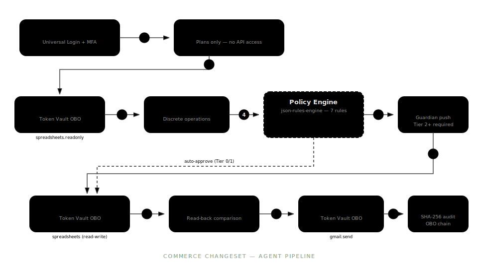

# Commerce Changeset

[](https://github.com/jeffgreendesign/commerce-changeset/actions/workflows/ci.yml)
[](LICENSE)
[](https://nextjs.org/)
[](https://www.typescriptlang.org/)
[](https://auth0.com/)
[](https://tailwindcss.com/)

Multi-agent commerce operations — pricing, promotions, inventory, product creation — through auditable, authorization-gated AI workflows. Built for the Auth0 **"Authorized to Act"** hackathon.

**[Live Demo](https://commerce-changeset.vercel.app)** · **[Blog Post](https://commerce-changeset.vercel.app/blog/building-trust-surfaces-for-ai-agents)**

---

Commerce operations involve real money. When AI agents can modify pricing, toggle promotions, create products, and send notifications on behalf of users, the authorization model can't be an afterthought. Most agentic AI demos treat auth as a checkbox — we built a system where every agent action flows through explicit permission boundaries, risk-gated approval, and cryptographic audit trails.

## What It Does

Four specialized agents decompose a natural language commerce request into discrete operations, evaluate each against a policy engine, gate writes behind CIBA push approval, execute via scoped Token Vault delegation, verify results with a read-back pass, and produce a SHA-256 audited execution receipt.

- 7-step manual commerce workflow → single natural language request
- Token management for 3 Google APIs (Sheets read, Sheets write, Gmail send) with zero frontend token exposure
- 100% of write operations gated by CIBA Guardian push approval
- 7 policy rules evaluated per operation — including 2 voice-aware stress/fatigue escalation rules
- Per-agent OAuth scope isolation: Reader (readonly), Writer (read-write), Notifier (gmail.send)
- SHA-256 audit hash over complete OBO delegation chain

## Architecture



1. User authenticates via Auth0 Universal Login
2. Natural language request → Orchestrator Agent (no API access, plans only)
3. Orchestrator delegates to Reader Agent (Token Vault → `spreadsheets.readonly`)
4. Orchestrator decomposes request into discrete operations via LLM
5. Each operation evaluated by json-rules-engine policy engine (7 rules)
6. If risk tier ≥ 2 → CIBA request sent to Auth0 Guardian → user approves via push notification
7. Approved operations → Writer Agent (Token Vault → `spreadsheets`)
8. Writer results → Reader Agent verification read-back
9. Notifier Agent sends execution receipt via Gmail (Token Vault → `gmail.send`)
10. SHA-256 audit hash computed over complete delegation chain

### Agent Permission Boundaries

| Agent | Role | OAuth Scope | Can Write? | Token Vault |
|-------|------|-------------|------------|-------------|
| Reader | Product data queries | `spreadsheets.readonly` | No | Google Sheets (read) |
| Orchestrator | Request decomposition | None | No | N/A |
| Writer | Approved mutations | `spreadsheets` | Yes (after CIBA) | Google Sheets (read-write) |
| Notifier | Email receipts | `gmail.send` | Send only | Gmail |

### Policy Engine Rules

| Rule | Trigger | Risk Tier | Decision |
|------|---------|-----------|----------|
| read-auto-approve | Read operations | Tier 0 | Auto-approve |
| notify-auto-approve | Notifications | Tier 1 | Auto-approve |
| write-single-record | Single write | Tier 2 | CIBA required |
| write-bulk-records | 2+ records | Tier 3 | CIBA escalated |
| write-large-price-change | >25% price change | Tier 3 | CIBA escalated |
| stressed-user-write-escalation | Stress level >0.7 | Tier 3 | CIBA escalated |
| fatigued-session-write-escalation | Session >60 min | Tier 3 | CIBA escalated |

## Screenshots

<!-- Replace these with actual screenshots before Devpost submission -->


## Auth0 Integration

### Token Vault & OBO Delegation

Users connect their Google account once via Auth0 Connected Accounts. Auth0 stores the refresh token in Token Vault. At execution time, each agent exchanges the stored token for a scoped access token through Auth0's On-Behalf-Of flow. The app never sees or stores the user's Google credentials.

### CIBA + Guardian

All write operations trigger a CIBA request to Auth0 Guardian. The user receives a push notification with a binding message describing the operations (sanitized to 64 alphanumeric characters). Block mode waits up to 120 seconds for approval before timing out.

### json-rules-engine Policy Layer

A declarative, auditable policy engine evaluates every operation against 7 rules before execution. The engine considers operation type, affected record count, price change magnitude, and voice-derived stress/fatigue signals. This is the novel contribution — authorization that adapts to cognitive state, not just permission grants.

## Built With

- [Next.js 16](https://nextjs.org/) (App Router) + [React 19](https://react.dev/)
- [TypeScript](https://www.typescriptlang.org/) (strict mode)
- [Tailwind CSS v4](https://tailwindcss.com/) + [Base UI](https://base-ui.com/) + [shadcn/ui](https://ui.shadcn.com/)
- [Auth0](https://auth0.com/) — `@auth0/nextjs-auth0` v4, Token Vault, CIBA + Guardian
- [Vercel AI SDK](https://sdk.vercel.ai/) + `@auth0/ai-vercel`
- [Anthropic Claude Sonnet](https://www.anthropic.com/) — agent LLM
- [Gemini Live API](https://ai.google.dev/) — real-time voice input
- [json-rules-engine](https://github.com/CacheControl/json-rules-engine) — policy evaluation

## What Is Real vs. Simulated

Transparency for reviewers: this table describes what runs against live APIs vs. what is simulated for demo stability.

| Component | Status |
|-----------|--------|
| Auth0 Universal Login | Live — real Auth0 tenant |
| Token Vault OBO delegation (Reader, Writer, Notifier) | Live — real token exchange per request |
| Google Sheets read/write | Live — real Google Sheets API calls |
| Gmail notification send | Live — real Gmail API via Token Vault OBO |
| CIBA + Guardian push approval | Live — real push notification to Auth0 Guardian app |
| Policy engine (7 rules, json-rules-engine) | Live — evaluated on every operation (real-time rules engine) |
| SHA-256 audit hash | Live — computed over real delegation chain |
| Verify-after-write read-back | Live — Reader Agent re-reads Sheets post-write |
| Voice stress/fatigue signals | Simulated — demo mode uses synthetic affect values (real voice input not used in demo) |
| Judge mode (/judges) | Simulated — uses demo data to avoid requiring Google account linking |
| Product data (Google Sheet) | Reference dataset — sample commerce catalog, not production inventory |

## Challenges

Token Vault's async context requirement cost two days — the "No AI context found" error doesn't reference Token Vault or the `withTokenVault()` wrapper (Discovery 1). CIBA binding messages are restricted to 64 characters of alphanumeric text plus basic punctuation — no dollar signs, no unicode, discovered only at runtime (Discovery 2). Connected Accounts requires your own Google OAuth credentials, not Auth0's dev keys (Discovery 3). Rich Authorization Requests need an enterprise plan, so we stubbed the types and plumbing for when the plan tier allows it (Discovery 4).

## Accomplishments

- Per-agent OAuth scope isolation enforced at the Token Vault layer
- 7-rule policy engine with voice-aware stress/fatigue escalation
- Full verify-after-write pipeline with read-back comparison
- SHA-256 audit receipts over complete delegation chain
- CIBA approval flow with dynamic binding messages derived from changeset content

## What We Learned

See our [blog post: Building Trust Surfaces for AI Agents](https://commerce-changeset.vercel.app/blog/building-trust-surfaces-for-ai-agents) for the full writeup covering Token Vault integration patterns, CIBA pain points, and the stress-aware authorization model.

## What's Next

- Differentiated Tier 3 approval (confirmation phrases, shorter timeouts, dual-approver flows)
- Continuous trust scoring (real-time modulation of agent autonomy)
- Context boundary enforcement (Writer sees only approved operations, not full catalog)
- Ambient trust visualization (active delegations shown inline in agent workflow)

<details>
<summary><strong>Developer Setup</strong></summary>

### Getting Started

1. Install dependencies:

   ```bash
   npm install
   ```

2. Copy `.env.example` to `.env.local` and fill in your credentials:

   ```bash
   cp .env.example .env.local
   ```

3. Start the development server:

   ```bash
   npm run dev
   ```

Open [http://localhost:3000](http://localhost:3000).

### Environment Variables

| Variable | Description |
|----------|-------------|
| `AUTH0_SECRET` | Random 64-char hex string for session encryption |
| `AUTH0_DOMAIN` | Auth0 tenant domain (`your-tenant.auth0.com`) |
| `AUTH0_BASE_URL` | App base URL (`http://localhost:3000` for dev) |
| `AUTH0_ISSUER_BASE_URL` | Auth0 tenant URL (`https://your-tenant.auth0.com`) |
| `AUTH0_CLIENT_ID` | Auth0 application client ID |
| `AUTH0_CLIENT_SECRET` | Auth0 application client secret |
| `AUTH0_AUDIENCE` | Auth0 API audience identifier |
| `APP_BASE_URL` | App base URL for Connected Accounts flow |
| `GOOGLE_SHEET_ID` | Google Sheet ID for token-vault integration |
| `ANTHROPIC_API_KEY` | Anthropic API key for Claude model access |
| `AUTH0_CIBA_AUDIENCE` | (Optional) API audience for CIBA + RAR requests |
| `ENABLE_SPIKE` | Set to `true` to enable spike routes in production |
| `JUDGE_ACCESS_CODE` | (Optional) Shared access code for judge login at `/judges`. Generate with `openssl rand -hex 16` |

### Scripts

| Command | Description |
|---------|-------------|
| `npm run dev` | Start development server |
| `npm run build` | Production build |
| `npm run start` | Start production server |
| `npm run lint` | Run ESLint |
| `npm run typecheck` | Run TypeScript type checking |
| `npm run gates` | Run all quality gates (lint + typecheck + build) |
| `npm run verify` | Alias for `gates` |

### Peer Dependencies

This project uses Next.js 16.2.1 and React 19.2.4 alongside `@auth0/nextjs-auth0@^4.16.0`. If you encounter peer dependency conflicts during `npm install`, use:

```bash
npm install --legacy-peer-deps
```

</details>

## License

MIT
